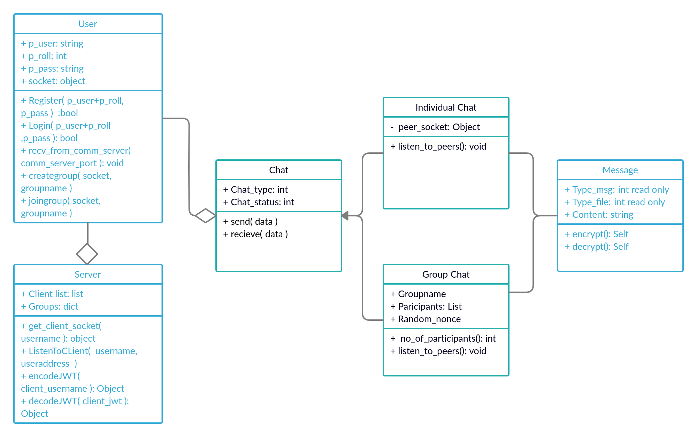

# ChatApp
An end to end messaging system similar to WhatsApp.

#### Team 2

- Shikhar Shasya [20171029]
- Shubham Sharma [20171012]
- Nikhil Jakhar [20171186]
- Keshavan Seshadri [20171051]

### How to run code:
```sh
$ python server.py
```
```sh
$ python client.py
```
Note: Run server and client on different terminals. Supports upto 10 clients(on different terminals).

### Commands:
- ```SEND username message``` : Sends message(encrypted) to a peer/client named username, p2p command.
- ```SEND FILE username filename_path``` : Sends text file(encrypted) to a peer/client named username.
- ```CREATE groupname``` : Client executing this command creates and joins the group named groupname.
- ```JOIN groupname``` : Client executing this command joins the group named groupname.
- ```LIST``` : Lists the groupnames and no. of users in them
- ```GROUP message``` : Client executing this command sends the message(encrypted) in the group/all the members in the group. 


